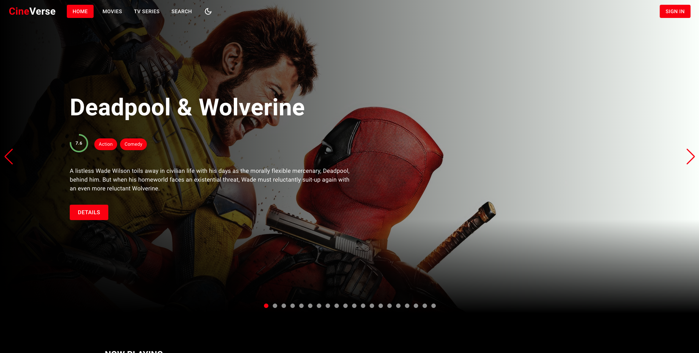

# CineVerse 🎥🌟



Welcome to **CineVerse**, a comprehensive movie and TV show database app built to help users explore and discover content effortlessly. Dive into an immersive experience, search your favorite titles, view detailed information, and stay updated with trending films and shows.

## Features

- 🎬 **Movie & TV Show Search**: Find your favorite movies and shows with ease.
- 🔐 **Authentication**: Secure login and signup functionality to personalize user experiences.
- 📊 **Trending Section**: Stay updated with what's currently trending.
- 🗂 **Detailed Pages**: Get in-depth information like cast, release date, synopsis, and more.
- 💬 **Add Reviews**: Share your thoughts by adding reviews for movies and shows.
- ❤️ **Add to Favorites**: Create a personalized list by adding titles to your favorites.

## Tech Stack

- **Frontend**: React.js, ReactRouterDom, React Redux, MaterialUI.
- **Backend**: Node.js, Express.js, MongoDB, JWT.
- **API**: TMDb API for real-time movie/show data.

## Setup Instructions

### Clone the repo:

```bash
git clone https://github.com/sharma1022/cine-verse.git
```

**Client**

### Install dependencies:

```bash
npm i
```

### Run the client server:

```bash
npm start
```

**Server**

### Install dependencies:

```bash
npm i
```

### Add environment variables in the .env file:

```bash
MONGODB_URL=
PORT=
TOKEN_SECRET=
TMDB_BASE_URL=
TMDB_KEY=
```

### Run the backend server:

```bash
npm start
```
